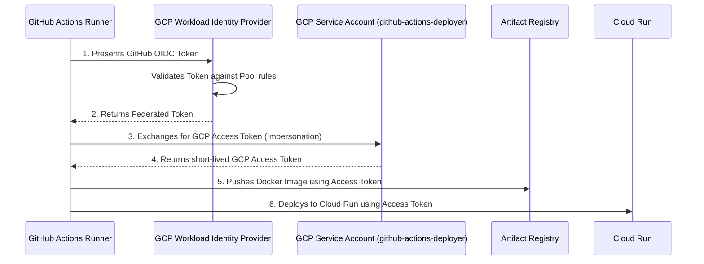
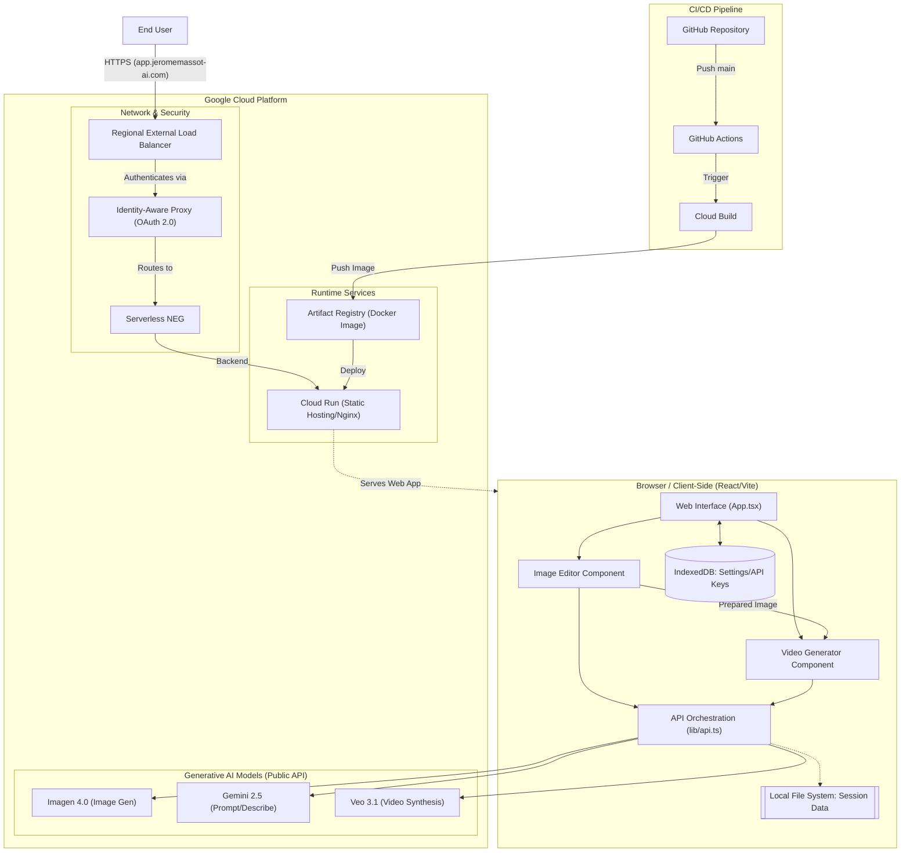

# AI Image and Video Scene Creator

        

## Executive Summary
The **AI Video Scene Creator** is a high-performance, web-based platform designed to bridge the gap between advanced generative AI models and non-technical marketing practitioners. Built with React and TypeScript, the application orchestrates a sophisticated pipeline involving image generation, semantic annotation, and video synthesis. 

This report details the technical competencies demonstrated in its implementation, focusing on AI orchestration, security patterns, and operational efficiency.


## 1. AI/ML Engineering

The platform demonstrates advanced **Model Orchestration** and **Domain-Applied AI/ML** expertise, specifically addressing model constraints for enterprise use cases (e.g., Mars, Zillow).

- **Multi-Model Pipeline**: The application orchestrates a three-tier generative workflow:
    1.  **Image Generation**: Leverages `imagen-4.0-generate-001` for high-fidelity base asset creation.
    
    2.  **Prompt Enhancement**: Uses `gemini-2.5-flash` to perform **Automatic Prompt Augmentation**, transforming simple user inputs into descriptive prompts enriched with professional photography techniques (e.g., lens selection, lighting, angles).
    
    3.  **Video Synthesis**: Integrates `veo-3.1-generate-preview` and `veo-3.1-fast-generate-preview`, allowing users to choose between quality and latency.

- **Structured AI Orchestration**: Logic centralizing these calls is found in [`lib/api.ts`], which manages model selection trade-offs and error handling.

- **Evidence**: See the implementation of `handleGenerateImageWithOptions` at [`api.ts:L111-L150`].

## 2. Security, Privacy, and Compliance

A pragmatic approach to security ensures data privacy while maintaining low friction for external stakeholders.

- **Persistent Permission Patterns**: The application utilizes the **File System Access API** for local session storage. Since browser permissions for file handles do not persist across reloads, a custom `verifyPermission` mechanism was implemented to handle `NotAllowedError` and re-authorize access gracefully.

- **Stateless Authentication**: Leveraging API Keys via HTTP headers allows for frictionless integration with the Public Gemini API, avoiding the complexity of OAuth for single-tenant marketing tools while maintaining auditability.

- **Local-First Data Residency**: Sensitive session data, prompts, and uploaded images are saved directly to the user's local machine using `FileSystemDirectoryHandle`, ensuring that source material never persists on an intermediate server.

- **Evidence**: Permission verification logic at [`lib/session.ts:L24-L40`].

## 3. Reliability & Resilience

The implementation focuses on **Graceful Degradation** and **Observability** in a browser environment.

- **Storage Resilience**: The app uses `idb` (IndexedDB) to persist critical settings (API Keys, directory handles) across sessions, implemented in [`lib/settings.ts`].

- **Failure Recovery**: The API interaction layer includes structured logging for generation configurations, enabling rapid debugging of model-specific failures or 404/403 errors related to API endpoints.

- **UI Reactivity**: The application uses a key-based re-mounting strategy for session isolation, ensuring that switching between "Image Editing" and "Video Generation" preserves the component state correctly.

## 4. Performance & Cost Optimization

Optimization is achieved through strategic model selection and resource-efficient architecture.

- **Inference Optimization**: The integration of **Veo 3.1 Fast** enables a "Low Latency" mode for rapid prototyping, significantly reducing token consumption and wait times during the creative iteration phase.

- **Client-Side Processing**: By offloading image annotation and state management to the client (React/Vite), the server costs are minimized to static asset delivery via a lightweight Nginx container.

- **Token Efficiency**: Grounding video generation in pre-annotated images reduces the complexity required in the text prompt, leading to more predictable model outputs and fewer wasted generation cycles.

## 5. Operational Excellence

The project follows modern **CI/CD** and **Cloud Native** deployment principles with a strong emphasis on security and automated provisioning.

- **Infrastructure as Code (IaC)**: The entire GCP infrastructure required for the CI/CD pipeline—including Artifact Registry, Service Accounts, and IAM bindings—is defined and provisioned using **Terraform** (located in the [`deployment/`](deployment) directory), ensuring reproducible environments and environment parity.

- **Keyless Authentication**: The CI/CD pipeline implements **Workload Identity Federation** (OIDC), eliminating the need for long-lived, sensitive service account keys to be exported or stored within GitHub Secrets. 

- **Automated Pipeline**: A streamlined CI/CD pipeline is implemented using **GitHub Actions**:
    1.  **Authentication**: Exchanges short-lived GitHub OIDC tokens for a federated GCP Access Token, strictly scoping access to the `github-actions-deployer` service account.
    2.  **Container Build**: Executes the multi-stage Docker build locally on the GitHub runner.
    3.  **Deployment**: Pushes the image to **Artifact Registry** and automatically deploys the updated container to **Cloud Run**.

- **Reproducible Environments**: The `Dockerfile` utilizes a multi-stage build (Node.js for compilation, Alpine-based Nginx for production) to ensure minimal image size, zero-downtime serving, and maximum portability.

- **Evidence**: Pipeline configurations in [`.github/workflows/deploy.yaml`](.github/workflows/deploy.yaml) and Terraform code in [`deployment/main.tf`](deployment/main.tf).

## 6. Designing for Change

The architecture prioritizes **Extensibility** and **Configuration Management**.

- **Externalized Knowledge Base**: Creative checklists and industry-specific guides are stored as Markdown, allowing content updates without code changes.

- **Model Agnostic Mapping**: Model identifiers are externalized in a mapping object within the components (e.g., [`VideoGenerator.tsx`]), enabling quick migration to newer model versions (e.g., moving from `v1beta` to `v1`).




## 7. System Architecture

The application's deployment architecture ensures high availability and zero-trust security:

- **Cloud Run Deployment**: The application is deployed as a fully managed **Cloud Run** service.
- **Managed Ingress**: The service is accessible only from a **Regional External Load Balancer**, with its backend pointing to a **Serverless Network Endpoint Group (NEG)**.
- **Secure Transport**: The frontend accepts only **HTTPS** connections, utilizing a dedicated SSL certificate linked to the `app.jeromemassot-ai.com` domain.
- **Edge Authentication**: Access is secured by an **Identity-Aware Proxy (IAP)** using an OAuth 2.0 client, ensuring robust authentication before traffic reaches the application.




## Conclusion

The **AI Video Scene Creator** represents a successful implementation of a cloud-native, AI-orchestrated platform. By prioritizing modularity and local-first data principles, the solution offers a secure and scalable environment for creative professionals. The integration of high-performance models like **Imagen 4.0** and **Veo 3.1** ensures that the platform remains at the cutting edge of generative AI, while the automated CI/CD pipeline guarantees operational excellence and rapid delivery of new features. 

This technical foundation positions the application as a robust baseline for future enhancements in domain-specific AI workflows.

## Repository Organization

```text
.
├── .github
│   └── workflows
│       └── deploy.yaml
├── app
│   ├── assets
│   ├── components
│   ├── lib
│   ├── App.tsx
│   ├── Dockerfile
│   ├── index.html
│   ├── index.tsx
│   ├── nginx.conf
│   ├── package.json
│   └── tsconfig.json
├── deployment
│   ├── backend.tf
│   ├── main.tf
│   ├── outputs.tf
│   ├── provider.tf
│   ├── terraform.tfvars
│   ├── variables.tf
│   └── wip.tf
├── drivers
│   └── instructions.txt
├── resources
│   ├── ai-image-video.jpg
│   └── Simple Platform,  Stunning Content.pdf
├── CI_CD_SETUP.md
└── README.md
```

## Author

Jerome Massot ([jeromemassot@google.com](https://jeromemassot@.google.com/))